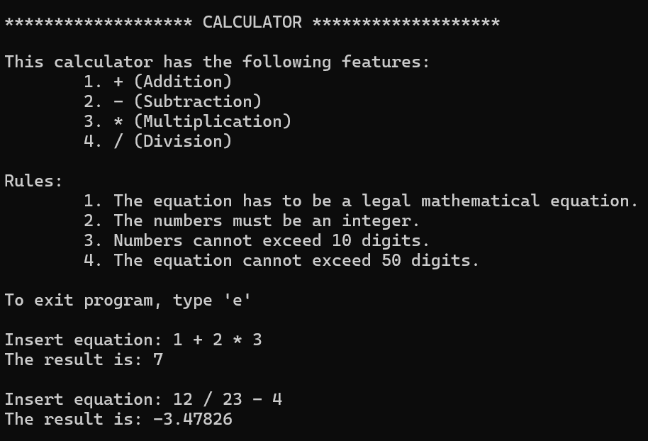
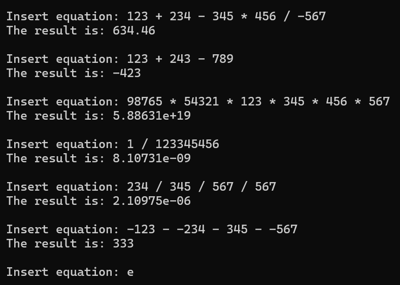

# Calculator
A terminal-based calculator that solves math equations.
## Features
- Validates user input.
- Handles math equations with addition, subtraction, multiplication, and division.
## Compile and Execute
g++ -o calc Calculator.cpp  
calc
## Screenshots
  
  

## Future Improvements
- Handles equations with parenthesis and/or other operations.
- Handles decimal numbers input.
- Internal structure modified to improve modularity.